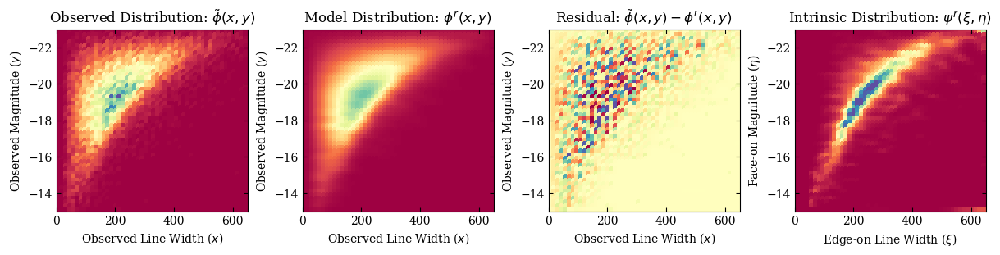

# Restoration of the Tully-Fisher Relation with the Lucy Rectification Algorithm

[](https://arxiv.org/abs/2401.13738) [](https://github.com/fuhaiastro/TFR_Lucy) [](https://opensource.org/licenses/MIT)

 

This repository accompanies the *Astrophysical Journal Letter*: Fu (2024) [Restoration of the Tully-Fisher Relation by Statistical Rectification](https://ui.adsabs.harvard.edu/abs/2024arXiv240113738F/abstract).

In the main folder I provide the merged ALFALFA-SDSS galaxy catalog
(`ALFALFA_SDSS_merged.csv`), a Python notebook that implements the Lucy rectification algorithm (`TFR.ipynb`), another Python notebook that illustrate the result at the last iteration (`TFR_plot.ipynb`), along with the preprint article (`2401.13738.pdf`). 

The subfolder `xsig20.0_ysig0.14_w30` contains the data files and the
figures generated by the Python notebooks and the folder name indicates the values of the key parameters in the joint probability density function. 

Please cite [Fu (2024)](http://arxiv.org/abs/2401.13738) if you find this work useful to your research. The BibTeX entry is:

```
@ARTICLE{2024ApJ...963L..19F,
       author = {{Fu}, Hai},
        title = "{Restoration of the Tully{\textendash}Fisher Relation by Statistical Rectification}",
      journal = {\apjl},
     keywords = {Astrostatistics, Scaling relations, Disk galaxies, Galaxy rotation, Galaxy luminosities, 1882, 2031, 391, 618, 603, Astrophysics - Astrophysics of Galaxies, Astrophysics - Instrumentation and Methods for Astrophysics},
         year = 2024,
        month = mar,
       volume = {963},
       number = {1},
          eid = {L19},
        pages = {L19},
          doi = {10.3847/2041-8213/ad2856},
archivePrefix = {arXiv},
       eprint = {2401.13738},
 primaryClass = {astro-ph.GA},
       adsurl = {https://ui.adsabs.harvard.edu/abs/2024ApJ...963L..19F},
      adsnote = {Provided by the SAO/NASA Astrophysics Data System}
}
```

### MIT License

Copyright (c) 2024 Hai Fu

Permission is hereby granted, free of charge, to any person obtaining a copy of this software and associated documentation files (the "Software"), to deal in the Software without restriction, including without limitation the rights to use, copy, modify, merge, publish, distribute, sublicense, and/or sell copies of the Software, and to permit persons to whom the Software is furnished to do so, subject to the following conditions:

The above copyright notice and this permission notice shall be included in all copies or substantial portions of the Software.

THE SOFTWARE IS PROVIDED "AS IS", WITHOUT WARRANTY OF ANY KIND, EXPRESS OR IMPLIED, INCLUDING BUT NOT LIMITED TO THE WARRANTIES OF MERCHANTABILITY, FITNESS FOR A PARTICULAR PURPOSE AND NONINFRINGEMENT. IN NO EVENT SHALL THE AUTHORS OR COPYRIGHT HOLDERS BE LIABLE FOR ANY CLAIM, DAMAGES OR OTHER LIABILITY, WHETHER IN AN ACTION OF CONTRACT, TORT OR OTHERWISE, ARISING FROM, OUT OF OR IN CONNECTION WITH THE SOFTWARE OR THE USE OR OTHER DEALINGS IN THE SOFTWARE.
